# rgoogleads: R пакет для работы с Google Ads API <a href='https://selesnow.github.io/rgoogleads/'>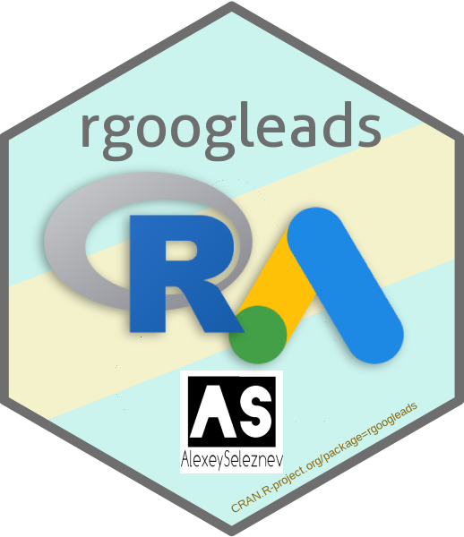</a>

<!-- badges: start -->
<!-- badges: end -->

Пакет `rgoogleads` предназначен для работы с [Google Ads API v8](https://developers.google.com/google-ads/api/docs/start) на языке R.

## Установка

На данный момент пакет доступен для установки только из [GitHub](https://github.com), используйте команду:
```r
devtools::install_github('selesnow/rgoogleads')
```

В ближайшее время пакет будет доступен для скачивания с CRAN.

## Политика конфиденциальности

Пакет `rgoogleads` для авторизации использует пакет [gargle](https://gargle.r-lib.org/), полученные при автризации учётные данные хранятся исключительно на вашем локальном ПК, узнать папку в которую кешируются учтные данные можно функцией `gads_auth_cache_path()`.

Пакет не передаёт ваши учётные данные, или данные полученные из ваших рекламных аккаунтов третим лицам, тем не менее ответвенность за утечку информации остаётся на стороне пользователя пакета. Автор не несён никакой ответвенности за их сохранность, будьте блительны при передаче кешированных учётных данных третим лицам.

## Что вам необходимо для начала работы

### Токен разработчика (Developer token)

В `rgoogleads` есть вшитый токен разработчика который вы можете использовать, но при большом колличестве пользователей пакета, есть вероятность столбкнуться с существующими лимитами, т.к. на данный момент вшитый токен имеет базовый уровень доступа к API.

Получить товен можно следующим образом:

1. Подать заявку на получение токена разработчика можно в интерфейсе управляющего аккаунта Google Ads (Инструменты -> Центр API). Если у вас нет управляющего аккаунта создайте его перейдя по [ссылке](https://ads.google.com/intl/ru_ru/home/tools/manager-accounts/). Важно, что если к вашему Google аккаунту уже привязан какой либо Google Ads аккаунт, вы не смоэете создать под ним управляющий аккаунт, в таком случае сначала понадобится завести ещё один Google аккаунт.
    
2. Далее идём Инструменты -> Центр API, и заполняем нужные поля

<center></center>

<Br>

3. Таким образом вы получите тестовый токен, с помощью которого можно работать только с тестовыми аккаунтами, поэтому сразу можете подавать заявку на базовый доступ к API.
    
<Br>
    
<center>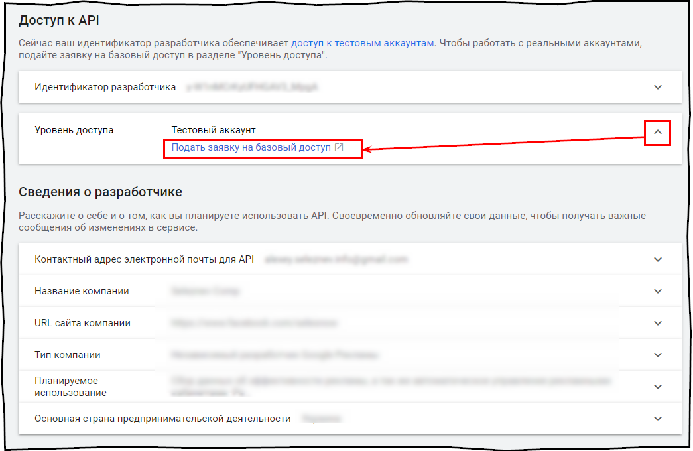</center>
        
<Br>

### Проект в Google Cloud с OAuth клиентом

Помимо токена разработчика вам необходимо создать проект в Google Cloud, в нём создать OAuth клиент, и активировать Google Ads API. 

1. Для создания проекта перейдите в [Google Cloud Console](https://console.cloud.google.com/home/) и нажмите на меню выбора проекта, далее жмите create project.
    
<Br>
    
<center>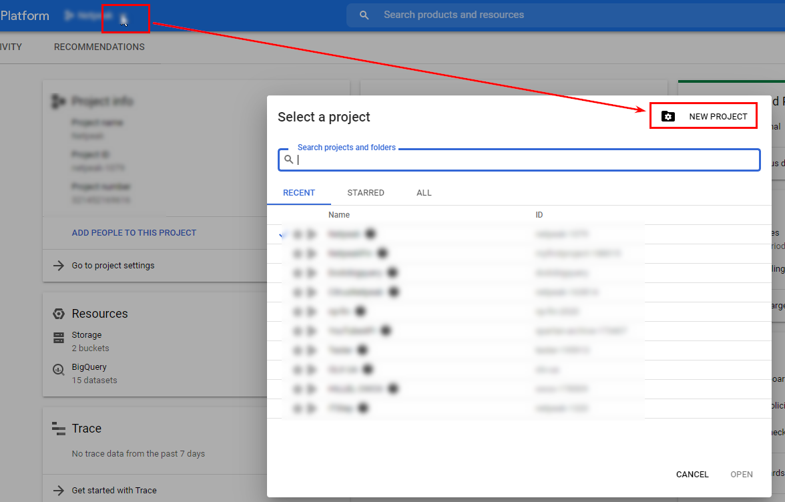</center>
    
<Br>
    
2. Далее в основном меню перейдите в раздел APIs & Services > Oauth consent screen.
    
<Br>
    
<center>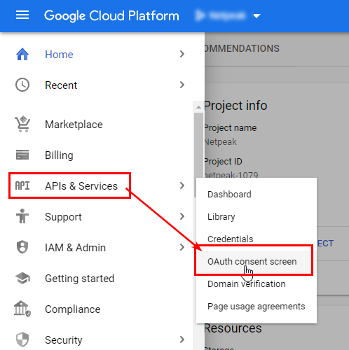</center>
    
<Br>
    
3. Заполните все необхоимые поля, и перейдите в меню Credentials > Create credentials > OAuth client ID
    
<Br>
    
<center>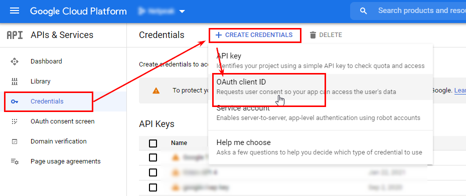</center>
    
<Br>
    
4. Из выпадающего меню выбираем Desktop app, вводим название приложение и жмём create
    
<Br>
        
<center>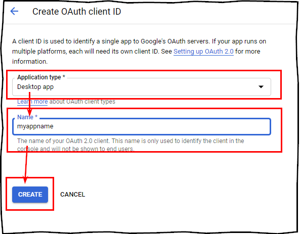</center>
    
<Br>
    
5. На этом настройка приложения закончена жмём ОК
    
<Br>
    
<center>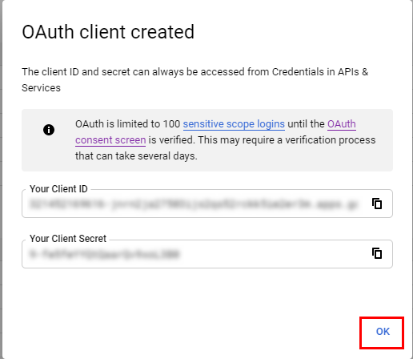</center>
    
<Br>
    
6. Теперь, для удобства созданное приложение можно сохранить на ПК, название файла при сохранении может быть произвольным, допустим что мы сохранили его с именем app.json по ардесу C:/auth.
    
<Br>
    
<center>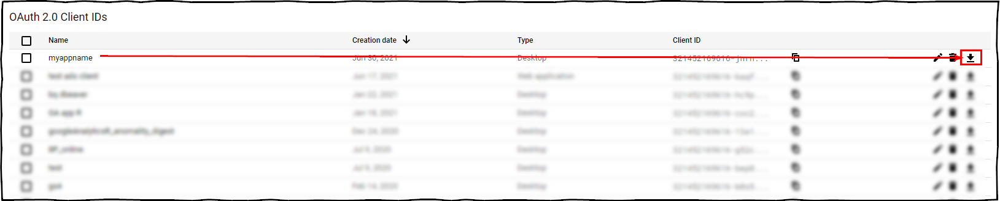</center>
    
<Br>
    
7. Последнем шагом настройки проекта в Google Cloud необходимо включить Google Ads API, переходим в раздел library
    
<Br>
    
<center>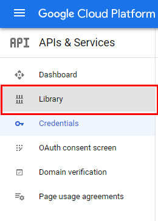</center>
    
<Br>
    
8. В поиске пишем Google Ads
    
<Br>
    
<center>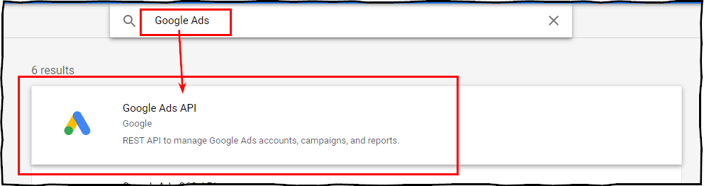</center>
    
<Br>
    
9. Включаем в проекте Google Ads API
    
<Br>
    
<center>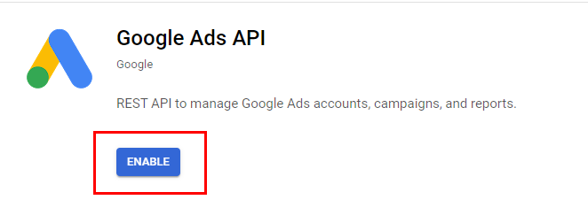</center>
    
<Br>

### Важная информация о совместном использовании токена разработчика и OAuth клиента приложения

* У компании, т.е. юр. лица должен быть только один токен разработчика.
* При первом использовании OAuth клиент из проекта Google Cloud с токеном разработчика, идентификатор клиента привязывается к токену разработчика и не может использоваться с другим токеном разработчика. Другими словами:
    * Токен разработчика можно использовать с несколькими идентификаторами клиентов.
    * Однако идентификатор Oauth клиента можно использовать только с одним токеном разработчика.
    
## Пример использования пакета

This is a basic example which shows you how to solve a common problem:

``` r
library(rgoogleads)

# auth
# установка созданнового вами приложения
gads_auth_configure(path = 'C:/auth/app.json')
# логин и токен разработчика
# если у вас нет токена разработчика можете его не указывать
gads_auth(email = 'ваша.почта@gmail.com', developer_token = "токен разработчика")

# Получить список доступных аккаунтов верхнего уровня
# под авторизованным логином
my_accounts <- gads_get_accessible_customers()

# Установка MCC для работы с агентским аккаунтом
# При работе с обычным аккаунтом этот пункт можно упустить
gads_set_login_customer_id('xxx-xxx-xxxx')

# Установка клиенткого аккаунта
gads_set_customer_id('xxx-xxx-xxxx')

# Загрузка отчёта
ad_group_report <- gads_get_report(
  resource    = "ad_group",
  fields = c("ad_group.campaign",
             "ad_group.id",
             "ad_group.name",
             "ad_group.status",
             "metrics.clicks",
             "metrics.cost_micros"),
  date_from   = "2021-06-10",
  date_to     = "2021-06-17",
  where       = "ad_group.status = 'ENABLED'",
  order_by    = c("metrics.clicks DESC", "metrics.cost_micros")
)
```

## Детальная информация
Для получения подробной справки на данный момент смотрите справку к функции `?gads_get_report`.

### Автор пакета
Алексей Селезнёв, Head of analytics dept. at [Netpeak](https://netpeak.net)
<Br>Telegram Channel: R4marketing
<Br>email: selesnow@gmail.com
<Br>facebook: [facebook.com/selesnow](https://www.facebook.com/selesnow)
<Br>blog: [alexeyseleznev.wordpress.com](https://alexeyseleznev.wordpress.com/)
