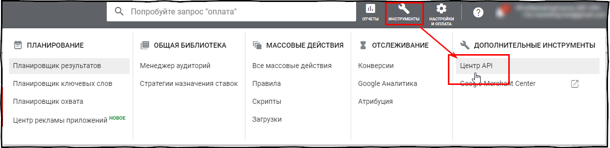

# rgoogleads: R пакет для работы с Google Ads API <a href='https://selesnow.github.io/rgoogleads/'></a>

<!-- badges: start -->
<!-- badges: end -->

Пакет `rgoogleads` предназначен для работы с [Google Ads API v8](https://developers.google.com/google-ads/api/docs/start) на языке R.

## Установка

На данный момент пакет доступен для установки только из [GitHub](https://github.com), используйте команду:
```r
devtools::install_github('selesnow/rgoogleads')
```

В ближайшее время пакет будет доступен для скачивания с CRAN.

## Что вам необходимо для начала работы

* Токен разработчика (Developer token), в пакете есть вшитый токен разработчика который вы можете использовать, но при большом колличестве пользователей пакета, вы можете столкнуться с лимитами. 

    * Подать заявку на получение токена разработчика можно в интерфейсе управляющего аккаунта Google Ads (Инструменты -> Центр API). Если у вас нет управляющего аккаунта создайте его перейдя по [ссылке](https://ads.google.com/intl/ru_ru/home/tools/manager-accounts/). Важно, что если к вашему Google аккаунту уже привязан какой либо Google Ads аккаунт, вы не смоэете создать под ним управляющий аккаунт, в таком случае сначала понадобится завести ещё один Google аккаунт.
    
    * Далее идём Инструменты -> Центр API, и заполняем нужные поля

    <Br>
    
    <center></center>
    
    <Br>
    
    * Таким образом вы получите тестовый токен, с помощью которого можно работать только с тестовыми аккаунтами, поэтому сразу можете подавать заявку на базовый доступ к API/
    
    <Br>
    
    <center></center>
        
    <Br>

* Проект в Google Cloud с созданными учётными данными и включённым Google Ads API. 
    <Br>
    
    * Для создания проекта перейдите в [Google Cloud Console](https://console.cloud.google.com/home/) и нажмите на меню выбора проекта, далее жмите create project.
    
    <Br>
    
    <center></center>
    
    <Br>
    
    * Далее в основном меню перейдите в раздел APIs & Services > Oauth consent screen.
    
    <Br>
    
    <center></center>
    
    <Br>
    
    * Заполните все необхоимые поля, и перейдите в меню Credentials > Create credentials > OAuth client ID
    
    <Br>
    
    <center></center>
    
    <Br>
    
    * Из выпадающего меню выбираем Desktop app, вводим название приложение и жмём create
    
    <Br>
        
    <center></center>
    
    <Br>
    
    * На этом настройка приложения закончена жмём ОК
    
    <Br>
    
    <center></center>
    
    <Br>
    
    * Теперь, для удобства созданное приложение можно сохранить на ПК, название файла при сохранении может быть произвольным, допустим что мы сохранили его с именем app.json по ардесу C:/auth.
    
    <Br>
    
    <center></center>
    
    <Br>
    
    * Последнем шагом настройки проекта в Google Cloud необходимо включить Google Ads API, переходим в раздел library
    
    <Br>
    
    <center></center>
    
    <Br>
    
    * В поиске пишем Google Ads
    
    <Br>
    
    <center></center>
    
    <Br>
    
    * Включаем в проекте Google Ads API
    
    <Br>
    
    <center></center>
    
    <Br>
    
## Пример использования пакета

This is a basic example which shows you how to solve a common problem:

``` r
library(rgoogleads)

# auth
# установка созданнового вами приложения
gads_auth_configure(path = 'C:/auth/app.json')
# логин и токен разработчика
# если у вас нет токена разработчика можете его не указывать
gads_auth(email = 'ваша.почта@gmail.com', developer_token = "токен разработчика")

# Получить список доступных аккаунтов верхнего уровня
# под авторизованным логином
my_accounts <- gads_get_accessible_customers()

# Установка MCC для работы с агентским аккаунтом
# При работе с обычным аккаунтом этот пункт можно упустить
gads_set_login_customer_id('xxx-xxx-xxxx')

# Установка клиенткого аккаунта
gads_set_customer_id('xxx-xxx-xxxx')

# Загрузка отчёта
ad_group_report <- gads_get_report(
  resource    = "ad_group",
  fields = c("ad_group.campaign",
             "ad_group.id",
             "ad_group.name",
             "ad_group.status",
             "metrics.clicks",
             "metrics.cost_micros"),
  date_from   = "2021-06-10",
  date_to     = "2021-06-17",
  where       = "ad_group.status = 'ENABLED'",
  order_by    = c("metrics.clicks DESC", "metrics.cost_micros")
)
```

## Детальная информация
Для получения подробной справки на данный момент смотрите справку к функции `?gads_get_report`.

### Автор пакета
Алексей Селезнёв, Head of analytics dept. at [Netpeak](https://netpeak.net)
<Br>Telegram Channel: R4marketing
<Br>email: selesnow@gmail.com
<Br>facebook: [facebook.com/selesnow](https://www.facebook.com/selesnow)
<Br>blog: [alexeyseleznev.wordpress.com](https://alexeyseleznev.wordpress.com/)
